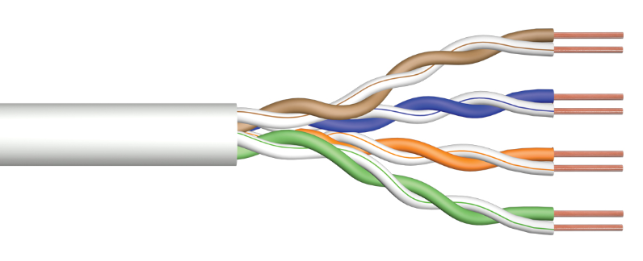

* [Topologías de red](#topologías-de-red)
    * [Bus](#bus)
    * [Estrella](#estrella)
    * [Anillo](#anillo)
    * [Malla](#malla)
* [Estructura de la red](#estructura-de-la-red)
    * [Niveles de la arquitectura de red](#niveles-de-la-arquitectura-de-red)
        * [Core Network](#core-network)
        * [Access Network](#access-network)
        * [Edge Network](#edge-network)
    * [Access Network - Acceso residencial](#access-network---acceso-residencial)
        * [Digital Subscriber Line (DSL)](#digital-subscriber-line-dsl)
        * [Cable modem](#cable-modem)
        * [Dial Up](#dial-up)
        * [Fiber-To-the-home (FTTH)](#fiber-to-the-home-ftth)
    * [Core Network - Transferencia de datos](#core-network---transferencia-de-datos)
        * [Conmutación de circuitos](#conmutación-de-circuitos)
        * [Conmutación de paquetes](#conmutación-de-paquetes)
    * [Edge Network - Protocolos](#edge-network---protocolos)
        * [Transmission Control Protocol (TCP)](#TCP)
        * [User Datagram Protocol (UDP)](#UDP)
* [Medios físicos](#medios-físicos)
    * [Par trenzado](#par-trenzado)
    * [Cable coaxial](#cable-coaxial)
    * [Fibra óptica](#fibra-óptica)
* [Internet Service Provider (ISP)](#internet-service-provider-isp)
    * [ISP de nivel 1](#isp-de-nivel-1)
    * [ISP de nivel 2](#isp-de-nivel-2)
    * [ISP de nivel 3](#isp-de-nivel-3)
* [Extras](#extras)
    * [Store and Forward (almacenamiento y reenvio)](#store-and-forward-almacenamiento-y-reenvio)
* [Glosario](#glosario)
* [Webgrafía](#webgrafía)

# Topologías de red

Disposición de los dispositivos o nodos de una red (computadoras, enrutadores, servidores, puntos de acceso, etc).

<table>
    <tr>
        <th></th>
        <th id="bus">Bus</th>
        <th id="estrella">Estrella</th>
        <th id="anillo">Anillo</th>
        <th id="malla">Malla</th>
    </tr>
    <tr>
        <td>Definición</td>
        <td>
            Todos los dispositivos están conectados a un solo cable central llamado "bus" o "troncal". Los datos enviados por cualquier dispositivo se transmiten a lo largo del bus y son recibidos por todos los dispositivos, pero solo el destinatario real acepta y procesa los datos.
        </td>
        <td>
            Todos los dispositivos están conectados a un solo nodo central, como un switch o un hub. Los datos pasan primero por el nodo central, que luego los dirige al dispositivo destinatario.
        </td>
        <td>
            En este tipo de arreglo, todos los dispositivos están ubicados formando un círculo donde cada uno tiene dos vecinos directos para la comunicación. Los datos viajan en una dirección (puede ser unidireccional o bidireccional) y pasan por cada dispositivo hasta llegar al destino.
        </td>
        <td>
            Cada dispositivo está conectado al resto de dispositivos de la red. Los datos pueden tomar múltiples caminos para llegar al destino.
        </td>
    </tr>
    <tr>
        <td>Ventajas</td>
        <td>
            <ul>
                <li>Fácil de instalar debido a tener menor cantidad de cables comparado con otras topologías.</li>
            </ul>
        </td>
        <td>
            <ul>
                <li>Fácil de instalar y gestionar.</li>
                <li>Si una conexión falla, no afecta a las demás conexiones.</li>
            </ul>
        </td>
        <td></td>
        <td>
            <ul>
                <li>Si una conexión falla, los datos pueden ser dirigidos por otro camino.</li>
            </ul>
        </td>
    </tr>
    <tr>
        <td>Desventajas</td>
        <td>
            <ul>
                <li>Si el bus falla, toda la red cae.</li>
                <li>Difícil de diagnosticar y resolver problemas.</li>
            </ul>
        </td>
        <td>
            <ul>
                <li>Si el nodo central falla, toda la red cae.</li>
                <li>Requiere más cable que una topología de bus.</li>
            </ul>
        </td>
        <td>
            <ul>
                <li>Si un dispositivo o conexión falla, puede afectar a toda la red.</li>
                <li>Difícil de diagnosticar y reparar problemas.</li>
            </ul>
        </td>
        <td>
            <ul>
                <li>Costosa y compleja de instalar debido a la cantidad de cableado necesario.</li>
                <li>Difícil de gestionar en redes grandes.</li>
            </ul>
        </td>
    </tr>
</table>

# Estructura de la red

### Niveles de la arquitectura de red

<table>
    <tr>
        <th></th>
        <th id="core-network">Core Network</th>
        <th id="access-network">Access Network</th>
        <th id="edge-network">Edge Network</th>
    </tr>
    <tr>
        <td>Definición</td>
        <td>
            Es la parte central de una red que proporciona servicios a clientes conectados a través de la Access Network. Es responsable de enrutar el tráfico de datos, gestionar la movilidad de los usuarios y proporcionar servicios de red avanzados.
        </td>
        <td>
            Es la parte de la red que conecta a los usuarios finales con la Core Network. Esta red proporciona el enlace directo entre los dispositivos de los usuarios (como teléfonos móviles, computadoras, etc.) y la infraestructura de red más amplia.
        </td>
        <td>
            Se refiere a los nodos de la red que están ubicados cerca de los usuarios finales. Esta red maneja y procesa datos localmente para reducir la latencia y mejorar la eficiencia de la red antes de que los datos sean enviados a la Core Network.
        </td>
    </tr>
    <tr>
        <td>Funciones</td>
        <td>
            <ul>
                <li>Maneja la mayoría del tráfico de datos entre diferentes partes de la red y hacia otras redes.</li>
                <li>Conecta llamadas o sesiones entre diferentes nodos de la red.</li>
            </ul>
        </td>
        <td>
            <ul>
                <li>Conecta los hosts (usuarios finales) con la red periférica.</li>
                <li>Provee la infraestructura necesaria para llevar la conexión desde el proveedor de servicios hasta el usuario final.</li>
            </ul>
        </td>
        <td>
            <ul>
                <li>Recoge el tráfico de datos de múltiples nodos de acceso, los procesa y optimiza el tráfico para reducir la carga en la red central.</li>
                <li>Reducción de latencia al acercar los servicios y el procesamiento de datos a los usuarios finales.</li>
                <li>Mejora la seguridad y protege los datos de los usuarios mediante la implementación de firewalls y sistemas de detección de intrusos.</li>
                <li>Utiliza servidores de caché para almacenar temporalmente contenido solicitado frecuentemente.</li>
            </ul>
        </td>
    </tr>
    <tr>
        <td>Componentes</td>
        <td>
            <ul>
                <li>Routers y switches de alta capacidad: dirigen grandes volúmenes de datos de manera eficiente.</li>
                <li>Enlaces de alta capacidad: como fibra óptica para transportar grandes volúmenes de datos.</li>
            </ul>
        </td>
        <td>
            <ul>
                <li>Tecnologías de banda ancha: ADLS, Fibra hasta el hogar (FTTH), cable, etc.</li>
                <li>Redes inalámbricas 4G/5G wifi.</li>
                <li>Equipos de usuario final: routers, módems, puntos de acceso inalámbricos.</li>
            </ul>
        </td>
        <td>
            <ul>
                <li>Routers y Switches</li>
                <li>Servidores de caché</li>
                <li>Firewalls y sistemas de seguridad</li>
                <li>Edge computing devices: equipos que procesan los datos de manera local para evitar enviar datos a centro de datos distantes (cámaras, autos, dispositivos de realidad aumentada).</li>
            </ul>
        </td>
    </tr>
</table>

### Access Network - Acceso residencial

#### Digital Subscriber Line (DSL)

El acceso a internet se proporciona a través de las líneas telefónicas de cobre existentes. Existen distintas variedades de DSL, siendo algunos de los más comunes:

* $\color{Orchid}{Asymemetric\ Digital\ Subscriber\ Line\ (ADSL)}$: las velocidades de descarga son más altas que las de carga. Generalmente, 24 Mbps de descarga y 1-3 Mbps de carga.

* $\color{Orchid}{Very-heigh-bit-rate\ Digital\ Subscriber\ Line\ (VDSL)}$: ofrece velocidades más altas que ADSL, pudiendo alcanzar los 100 Mbps o más dependiendo la distancia al nodo.

#### Cable modem

Utiliza la infraestructura de televisión por cable (coaxial) para proporcionar conectividad a internet.

* $\color{Orchid}{Hybrid\ Fiber-Coaxial\ (HFC)}$: es una arquitectura de red que utiliza fibra óptica para transportar señales a través de conexiones de alta velocidad desde el proveedor de servicios hasta un nodo próximo al usuario. Desde este nodo, las señales se transmiten a través de cable coaxial hasta los hogares.

#### Dial Up

Tecnología de acceso a internet más antigua (obsoleta). Hacía uso de un módem que convertía las señales digitales del ordenador en señales analógicas que podían transmitirse a través de la línea telefónica (podía resultar en tarifas telefónicas más elevadas según el uso, además de que la línea telefónica no podía ser utilizada para llamadas mientras se navegara por Internet).

#### Fiber-To-the-home (FTTH)

Ofrece gran velocidad y gran ancho de banda: 1Gbps de bajada, 100 Mbps de subida. La conexión de fibra óptica puede ser dedicada desde el proveedor hasta la casa del usuario, o puede ser una conexión de fibra compartida y luego fibras individuales al acercarse al hogar.

### Core Network - Transferencia de datos

#### Conmutación de circuitos 
Previo a que se transmita cualquier dato, se establece un camino dedicado para la conexión entre dos puntos. El mismo se mantiene activo durante toda la conexión. Ej: llamada telefónica.

#### Conmutación de paquetes
Los datos se dividen en paquetes más pequeños antes de ser enviados. Cada paquete que se envía de forma independiente y puede seguir distintas rutas para llegar a destino, donde se reensamblan en el orden correcto.

### Edge Network - Protocolos

<table>
    <tr>
        <th></th>
        <th id="TCP">Transmission Control Protocol (TCP)</th>
        <th id="UDP">User Datagram Protocol (UDP)</th>
    </tr>
    <tr>
        <td>Tipo de conexión</td>
        <td>
            <strong>Orientado a la conexión</strong> 
            Establece una conexión entre el emisor y el receptor antes de tranferir los datos. Este proceso se conoce como "handshake" de tres vías (SYN, SYN-ACK, ACK). 
            

        </td>
        <td>
            <strong>No orientado a la conexión</strong> 
            No establece una conexión previa antes de enviar datos, lo que lo hace más rápido y eficiente en términos de latencia.
        </td>
    </tr>
    <tr>
        <td>Fiabilidad</td>
        <td>
            <strong>Alta</strong> 
            Garantiza que los datos lleguen a destino en el mismo orden en que fueron enviados y sin errores. Si los datos se pierden o se dañan, TCP los retransmite.
        </td>
        <td>
            <strong>Baja</strong> 
            No garantiza la entrega de los datos, el orden de los paquetes ni la corrección de errores. Los datos pueden perderse, duplicarse o llegar desordenados.
        </td>
    </tr>
    <tr>
        <td>Control de flujo y control de congestión</td>
        <td>
            <strong>Implementados</strong> 
            TCP ajusta la velocidad de transmisión según la capacidad de la red y el receptor.
        </td>
        <td>
            <strong>No implementados</strong>
            Al no disponer de estos mecanismos, UDP tiene una sobrecarga menor (para el host) en comparación con TCP.
        </td>
    </tr>
    <tr>
        <td>Casos de uso</td>
        <td>
            <ul>
                <li>HyperText Transfer Protocol / Secure (HTTP/HTTPS)</li>
                <li>File transfer Protocol (FTP)</li>
                <li>Secure Shell (SSH)</li>
                <li>Simple Mail Transfer Protocol (SMTP)</li>
            </ul>
        </td>
        <td>
        <ul>
            <li>Domain Name System (DNS)</li>
            <li>Voice Over Internet Protocol (VOIP)</li>
            <li>Streaming de video/audio.</li>
        </ul>
        </td>
    </tr>
</table>

# Medios físicos

### Par trenzado

Pares de hilos de cobre que están trenzados entre sí para reducir la interferencia electromagnética (EMI) y la diafonía entre pares adyecentes. Este evento se produce cuando la señal fuerte de un par de cables es captada por un par de cables adyacentes. Por ejemplo, cuando se escucha otra conversación telefónica desconocida mientras se habla por teléfono con otra persona.

$\color{Orchid}{Uso\ común}$: redes ethernet, telefonía, etc.

> [!NOTE]
> Existen distintas variaciones de cables tipo par trenzado (UTP, FTP, STP, SFTP), cada uno con características que los distinguen del otro y que lo hacen más apto para situaciones puntuales. Por ejemplo, el par trenzado UTP (el de la imagen) no se encuentra recubierto por algún material que lo proteja de la interferencia EMI, por lo que es más apto para uso en espacios cerrados.

### Cable coaxial 

Consiste de un conductor central de cobre rodeado por un aislante, un blindaje metálico trenzado y una cubierta exterior. El diseño ayuda a proteger los datos de la interferencia EMI.

$\color{Orchid}{Uso\ común}$: televisión por cable, internet de banda ancha, CCTV, otros sistemas de comunicación.

### Fibra óptica

Los datos son transmitidos como pulsos de luz a través de un núcleo central rodeado por un revestimiento de vidrio o plástico que refleja la luz.

$\color{Orchid}{Uso\ común}$: redes de área amplia (WAN), enlaces de larga distancia, telecomunicaciones, conexiones de alta velocidad en centros de datos.

# Internet Service Provider (ISP)

### ISP de nivel 1

* Son grandes proveedores de Internet que transportan vastos volúmenes de datos a través de largas distancias. Disponen de una infraestructura de red global integrada por cables submarinos, enlaces de fibra óptica y grandes centros de datos a nivel mundial.
* Intercambian tráfico con otros ISP de nivel 1 de forma gratuita mediante $\color{Orchid}{acuerdos\ de\ peering}$.

### ISP de nivel 2

* Ofrecen servicios de Internet a nivel regional o nacional, y tienen infraestructura de red significativa en esas áreas.
* Pueden realizar peering con otros ISP de nivel 2 y pagar a uno o más ISP de nivel 1 por el tránsito de datos.
* Actúan como intermediarios entre los ISP de nivel 1 y los ISP de nivel 3.

### ISP de nivel 3

* Tienen una infraestructura de red limitida y dependen de los ISP de nivel 2 para la conectividad global.
* Compran el servicio de Internet a los ISP de nivel 2 y lo revenden a los usuarios finales.

Para más información:  
[Puntos de Presencia (POP)](#pop)  
[Internet Exchange Point (IXP)](#ixp)  

# Extras

### Store and Forward (almacenamiento y reenvio)

En este tipo de arquitectura, un router tiene que recibir por completo un paquete antes de poder comenzar a transmitir el primer bit de dicho paquete a través del enlace de salida.

# Glosario

$\color{Orchid}{Red\ de\ computadoras}$: es un conjunto de hardware y software conectados entre sí mediante dispositivos físicos de envío y recepción de información que emplean un código común (protocolo).

$\color{Orchid}{Host}$: sistema terminal que corre las aplicaciones de red.

$\color{Orchid}{Protocolo}$: normas que rigen la comunicación entre dos o más entidades que comparten información.

$\color{Orchid}{Ethernet}$: es un conjunto de especificaciones y estándares que definen como se deben construir y operar las redes de área local (LAN).
* $\color{Orchid}{Protocolo\ de\ comunicación}$: Carrier Sense Multiple Access With Collision Detection (CSMA/CD).
* $\color{Orchid}{Tipo\ de\ cableado}$: por trenzado (Cat5, Cat5e, Cat6) y fibra óptica.
* $\color{Orchid}{Interfaz\ física}$: un ejemplo es el conector RJ45 para cables de par trenzado.
* $\color{Orchid}{Dispositivos\ de\ red}$: switches y hubs conectan múltiples dispositivos.
* $\color{Orchid}{Tramos\ Ethernet}$: define cómo deben estructurarse los datos que se transmiten, incluyendo la cabecera, la carga útil y la secuencia de verificación.

$\color{Orchid}{Internet}$: 
* Es una red de dispositivos (computadoras, celulares, relojes, heladeras, lavarropas, etc) interconectados entre sí a nivel mundial.
* Se lo considera el sistema de ingeniería más grande creado por el hombre.
* Protocolos estándar en Internet:
    * Request For Comments (RFC).
    * Internet Engineering Task Force (IETF).

$\color{Orchid}{Enlace\ físico}$: es el medio que existe entre un trasmisor y un receptor.

$\color{Orchid}{Medio\ guiado}$: la señal se propaga en un medio sólido: cobre, coaxial, fibra.

$\color{Orchid}{Medio\ no\ guiado}$: la señal se propaga libremente. Ej: radio, infra-rojo.

$\color{Orchid}{Puntos\ de\ presencia\ (POPs)}$: son ubicaciones donde los ISP tienen equipos de red (routers, switches, y otros dispositivos de telecomunicaciones) que permiten la conexión a la infraestructura de red.

* Actúan como nodos de conexión donde se intercambia el tráfico de datos entre distintas redes.
* El tráfico entrante es dirigido (enrutado) hacia su destino final de manera eficiente.

$\color{Orchid}{Internet\ exchange\ Point\ (IXP)}$: permite el intercambio de tráfico entre distintas redes (peering), y proporciona rutas adicionales para mejorar la eficiencia del enrutamiento del tráfico.

# Webgrafía

https://www.mdpi.com/1999-5903/2/4/603
