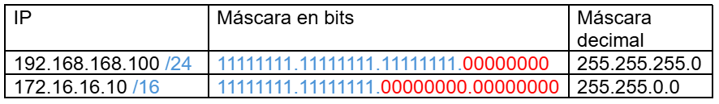
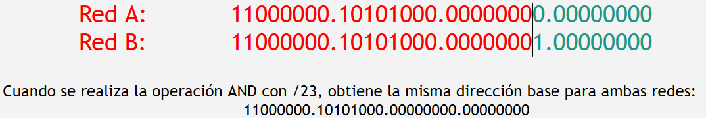

* [Modelo TCP/IP](#modelo-tcpip)
    * [Aplicación](#aplicación)
    * [Transporte](#transporte)
    * [Red](#red)
    * [Enlace](#enlace)
        * [Hub](#hub)
        * [Switch](#switch)
        * [MAC](#mac)
* [Dirección IP](#dirección-ip)
    * [Máscara de red](#máscara-de-red)
* [Router](#router)
    * [Subredes](#subredes)
        * [Variable Length Subnet Mask (VLSM)](#variable-length-subnet-mask-vlsm)
    * [Enrutamiento o ruteo](#enrutamiento-o-ruteo)
        * [Ruteo estático vs ruteo dinámico](#ruteo-estático-vs-ruteo-dinámico)
        * [Tablas de ruteo](#tablas-de-ruteo)
* [ARP (Adress Resolution Protocol)](#arp-adress-resolution-protocol)
* [Firewall](#firewall)
* [NAT](#nat)
* [DNAT](#dnat)
* [Extra](#extra)
* [Webgrafía](#webgrafía)

# Modelo TCP/IP

## Aplicación

Es la capa más cercana al usuario final. Se encarga de una variedad de funciones:

* Proporciona interfaces que permiten a los usuarios interactuar con la red.
* Proporciona servicios específicos de red como correo electrónico, tranferencia de archivos, navegación web, etc.
* Gestiona la autenticación de usuario y el acceso a recursos de la red del mismo.
* Gestiona el inicio, mantenimiento y terminación de sesiones de comunicación entre aplicaciones.

$\color{Orchid}{Protocolos\ principales}$:

* $\color{Orchid}{HyperText\ Transfer\ Protocol\ (HTTP)}$ $\rightarrow$ transferencia de documentos hipertexto.
* $\color{Orchid}{HyperText Transfer Protocol Secure (HTTPS)}$ $\rightarrow$ transferencia segura de documentos de hipertexto (utiliza SSL/TLS para cifrar la comunicación).
* $\color{Orchid}{File Transfer Protocol (FTP)}$ $\rightarrow$ transferencia de archivos entre un servidor FTP y un cliente.
* $\color{Orchid}{Simple Mail Transfer Protocol (SMTP)}$ $\rightarrow$ envio de correos desde un servidor de correo electrónico a otro servidor de correo electrónico.
* $\color{Orchid}{Domain Name System (DNS)}$ $\rightarrow$ se encarga de traducir un dominio(nombre) a su dirección IP. Utiliza UDP como su protocolo de transporte para enviar y recibir mensajes.

## Transporte

Se encarga de la tranferencia de datos host-host entre procesos para una aplicación específica. Para lograr esto, divide los datos en segmentos para su transmisión y luego los ensambla en el destino.

$\color{Orchid}{Protocolos\ principales}$: <a href="./unidad-1.md#edge-network---protocolos">TCP y UDP</a>

$\color{Orchid}{Componentes}$: Segmentos, números de puerto, direcciones IP.

## Red

Esta capa se encarga de determinar la mejor ruta para transmitir los datagras/paquetes (datos) desde el origen hasta el destino, incluso si estos están en distintas redes.

$\color{Orchid}{Protocolos\ principales}$: Internet Protocol (IP), Internet Control Message Protocol (ICMP), Adress Resolution Protocol (ARP), etc.

$\color{Orchid}{Componentes}$: routers, direcciones IP, tablas de ruteo.

[Más info sobre esta capa: protocolos, dispositivos, etc :arrow_down:](#dirección-ip)

## Enlace

Esta capa se encarga de la transferencia de datos entre nodos de una misma red. Las tramas de bits (datos) son organizados en unidades llamadas "frame", que además de los datos encapsulados, contienen información importante para la transferencia como son la MAC origen y MAC destino, control de errores, etc.

$\color{Orchid}{Protocolos\ principales}$: 

* $\color{Orchid}{Ethernet}$: define como se transmiten las tramas en una red de área local (LAN) cableado.
* $\color{Orchid}{wifi}$: permite la tranferencia de datos sin cables en una WLAN.

$\color{Orchid}{Componentes}$: direcciones MAC, tramas, switches, hubs.

### Hub

Puede ser visto como un repetidor multipuerto, regenera los datos y los transmite a todos los puertos. Los hubs tienen un único dominio de coalisión, lo que quiere decir que si los datos enviados por dos equipo colisionan en el segmento de uno de los puertos, todos los demás dispositivos (incluso estando conectados a distintos puertos) se verán afectados.

### Switch

Divide una red en varios dominios de colisión (1x puerto). El equipo almacena una tabla de registro (CAM) que asocia las MAC de los equipos con el puerto al que están conectados, permitiendo la transmisión de datos entre equipos mediante sus direcciones MAC.

### MAC

Identificador único de 48 bits que identifica a una tarjeta de red (NIC). Viene determinada por el fabricante y no puede repetirse.

Por ejemplo, las direcciones MAC que comienzan con 00:1e:c2 pertenecen al fabricante Apple.

# Dirección IP

Identifica un punto de acceso (interfaz) y al grupo de dispositivos conectados al mismo. Una IP consta de 32 dígitos en notación binaria (con lo que podríamos tener $2^32 = 4.294.967.296$) direcciones IP únicas.

* IPv4 $\rightarrow$ Internet Protocol version 4: 32 bits.
* IPv6 $\rightarrow$ Internet Protocol version 6: 128 bits.

Redes privadas:

* 10.0.0.0 - 10.255.255.255
* 172.16.0.0 - 172.31.255.255
* 192.168.0.0 - 192.168.255.255

### Máscara de red

Es otra forma de presentar una dirección IP, indicando qué parte de la dirección IP es el número de red (indicado con unos) y qué parte es la que corresponde al host (indicada con ceros.). La máscara se la subdivide en bloques de 8bits.

# Router

* Interconecta redes y reenvia paquetes. 
* En el mismo paquete se encuentra la IP destino a donde este debe viajar. El router, que es capaz de leer estos datos, consultará su tabla de ruteo para determinar el camino más eficiente para que el paquete llegue a destino.
* Los routers suelen poseer herramientas extras como firewall.

$\uparrow$ (Una dirección IP está asociada a cada interfaz del router).

Los routers dividen o separan una red en:

Un grupo de máquinas que poseen la misma dirección de subred se podrían interconectar sin necesitar un router (por ejemplo por medio de un switch o hub).

#### Variable Length Subnet Mask (VLSM)

Se utiliza para dividir una red en subredes de distintos tamaños.

1. Se ordenan los requerimientos de mayor a menor.
2. Se calcula cuántas direcciones IP serán necesarias, y en base a eso, se calcula la máscara de red requerida (no olvidar direcciones red base y broadcast de cada red).

Direcciones de red/subred reservadas:

* $\color{Orchid}{Dirección\ de\ red\ (o\ base)}$: es la primera dirección posible en el campo de host (bits de host serán todos ceros). La misma indica el segmento de red al que pertenecen uno o más dispositivos.

* $\color{Orchid}{Dirección\ de\ broadcast}$: es la última dirección posible en el campo de host (bits de host serán todos unos). A través de ella es que los equipos enviarán sus paquetes en caso de querer comunicarse con toda la red a la que pertenecen.

Tomando en cuenta lo anterior:

<table>
    <tr>
        <th>N° de hosts = 2b - 2, con b = num de bits disponibles para host</th>
    </tr>
</table>

### Enrutamiento o ruteo

Se trata de buscar el camino más óptimo de entre todos los posibles.

#### Ruteo estático vs ruteo dinámico

* $\color{Orchid}{Ruteo\ estático}$: las rutas en una red son configuradas manualmente. No cambian a menos que sean modificadas por el mismo administrador de red.

* $\color{Orchid}{Ruteo\ dinámico}$: utiliza protocolos de enrutamiento para descubrir y mantener automáticamente rutas en la red.

#### Tablas de ruteo

Rutas
* Directas
* Indirectas
* Default

$\color{Orchid}{Minimización\ por\ ruta\ por\ defecto}$: para eliminar una de las entradas por este método, la misma debe compartir mismo sig router e interfaz, y ser una red indirecta.

$\color{Orchid}{Minimización\ por\ sumarización}$: este método agrupa aquellas redes con misma máscara, tienen que ser contiguas, y tienen que tener mismo próximo router e interfaz.

$\color{Orchid}{Clasless\ Inter-Domain\ Routing\ (CIDR)}$: permite disminuir la sobrecarga de los routers al agrupar subredes cuyas IPs tienen una misma secuencia inicial.

# ARP (Adress Resolution Protocol)

$\color{Orchid}{Su\ misión\ es\ traducir\ la\ dirección\ IP\ de\ una\ máquina\ a\ la\ dirección\ física\ (MAC)\ del\ adaptador\ de\ red}$. Un equipo para comunicarse con otro dentro de su misma red necesita la MAC destino. El problema es que en algunos casos solo tiene la IP destino pero no la MAC destino. En estos casos entre el protocolo ARP:

1. El equipo "A" que desea iniciar comunicaciones envía una trama $\color{Orchid}{ARP\ REQUEST}$ hacia toda la red (broadcast).
2. El equipo "B" correspondiente rellena los datos faltantes y envía una trama $\color{Orchid}{ARP\ REPLY}$ al equipo que solicitó su MAC.
3. Una vez obtenida esta información, el equipo A añade la dirección MAC de B a su tabla ARP (todos los equipos poseen esta tabla que es gestionada por el SO).

<table>
    <tr>
        <td align= "center" width="400px">
            
            
La ARP REQUEST es aquello dentro del cuadro negro, su traducción sería algo así como "esta es mi IP (IP A), si tu IP es este (IP B), por favor coloca tu MAC en este campo (MAC ?)".

        </td>
    </tr>
</table>

* Internet está basado en direcciones IP.
* Ethernet está basado en direcciones MAC.
* Por cada interfaz del router se contruye una tabla ARP (las entradas de la misma se eliminan pasado un tiempo).

# Firewall

Sistema o grupo de sistemas utilizados para separar una máquina o una subred (zona protegida) del resto de la red (zona de riesgo). Controla las comunicaciones, permitiéndolas o prohibiéndolas según las políticas de que red establecidas.

* $\color{Orchid}{Perímetro\ interno}$: donde se sitúan todos los recursos sensibles a un posible ataque.
* $\color{Orchid}{Perímetro\ externo}$: donde se sitúan los recursos menos sensibles que necesitan ser accesibles desde la red externa por motivos funcionales.

El firewall actúa sobre la capa de red y la capa de transporte del modelo TCP/IP. Se encarga de analizar la cabecera de los paquetes sin llegar a los datos.

Existen dos políticas por defecto a la hora de configurar un firewall:

* $\color{Orchid}{Aceptación}$: se rechazan todas las conexiones consideradas peligrosas mientras que se aceptan o admiten todas las demás.

* $\color{Orchid}{Rechazo}$: se aceptan aquellas conexiones que se consideran legales o válidas mientras que se rechazan todas la demás.

# NAT

Técnica que permite a múltiples dispositivos en una red privada que compartan una única dirección IP pública para comunicarse en Internet. Cuando los dispositivos en una red local se conectan a Internet, los paquetes de datos enviados desde estos dispositivos tienen direcciones IP privadas, que no son únicas en Internet. NAT actúa como un intermediario entre la red local e Internet, traduciendo estas IPs privadas a una IP pública.

# DNAT

Esta técnica se utiliza para aquellos servicios que se encuentran dentro de una red privada y necesitan ser accesibles desde Internet. El tráfico entrante es redirigido desde una dirección IP y/o puerto específico a otra dirección IP y/o puerto dentro de una red privada (se añade una entrada fija en la tabla NAT).

Por ejemplo, si queremos tener un servidor WEB en nuestra red:

* Se debe crear una entrada fija en la tabla de NAT en la que se indique que lo que llegue al puerto 80 (web) sea dirigido al equipo en el que corre el servidor web.

# Netfilter/Iptables

# Extra

$\color{Orchid}{Comando\ ping}$: comprueba el estado de la comunicación del host local con un equipo remoto por medio del envío de paquetes ICMP de solicitud (ICMP ECHO REQUEST) y de respuesta (ICMP ECHO REPLY).

* $\color{Orchid}{ICMP\ Error\ Messages}$: Network unreachable, Host unreachable, Time exceeded(TTL por default 64 saltos).

$\color{Orchid}{Traceroute}$: herramienta para comprobar la trayectoria/ruta que siguen los paquetes desde un puerto inicial hasta llegar a destino. Envía paquetes por el protocolo UDP pero con un TTL que va aumentando en forma creciente.

$\color{Orchid}{Wireshark}$

$\color{Orchid}{Netcat}$

# Webgrafía

https://www.youtube.com/watch?v=ZNqBmVwZdoQ&list=PLbcS-eIZbbxWSCANJXiXj_5zBriR81m54&index=7

https://www.youtube.com/watch?v=2yJiH5lV2NM&list=PLbcS-eIZbbxWSCANJXiXj_5zBriR81m54&index=8

https://www.youtube.com/watch?v=g3vzBR5PR3o&list=PLbcS-eIZbbxWSCANJXiXj_5zBriR81m54&index=9

https://www.youtube.com/watch?v=1pB2kan_AFk

https://www.youtube.com/watch?v=7XCM8OBcmLM&list=PLbcS-eIZbbxWSCANJXiXj_5zBriR81m54&index=4

https://www.youtube.com/watch?v=NemUKjAsVY4&list=PLbcS-eIZbbxWSCANJXiXj_5zBriR81m54&index=6