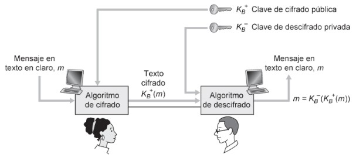
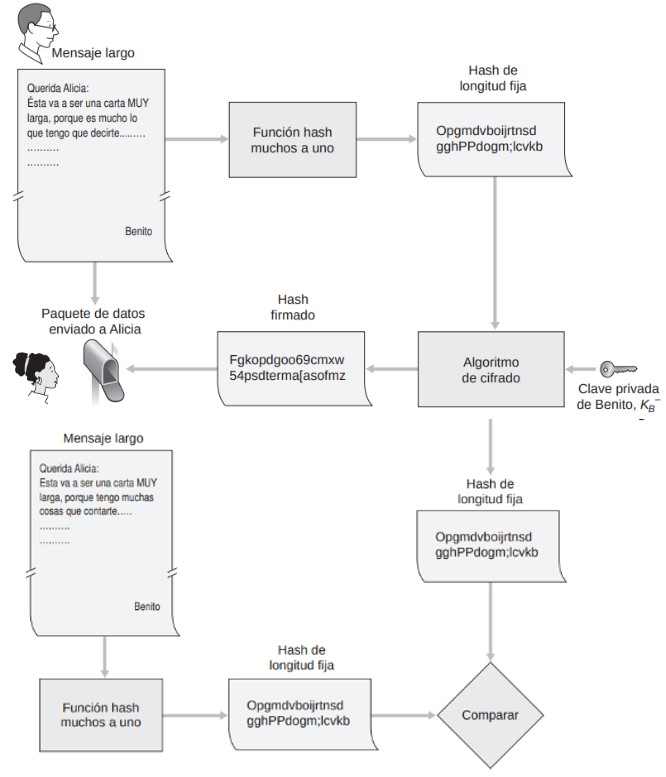
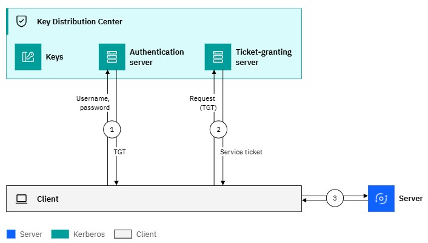
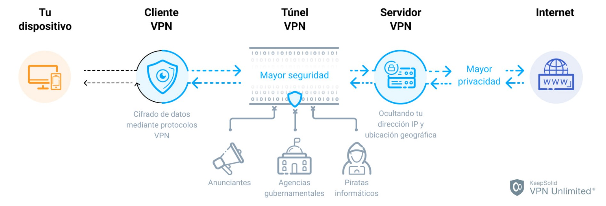
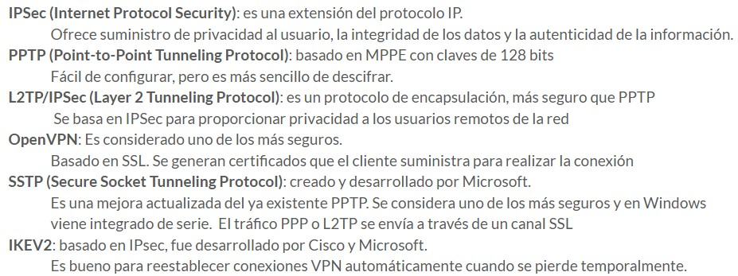

* [Criptografía](#criptografía)
* [Tipos de ataques](#tipos-de-ataques)
* [Cifrado simétrico](#cifrado-simétrico)
    * [Cifrado de César](#cifrado-de-césar)
    * [Cifrado de César combinado (Mono-Alfabético)](#cifrado-de-césar-combinado-mono-alfabético)
    * [Cifrado Poli-Alfabético](#cifrado-poli-alfabético)
* [Cifrado simétrico Moderno](#cifrado-simétrico-moderno)
    * [Cifrado de Flujo](#cifrado-de-flujo)
    * [Cifrado de Bloque](#cifrado-de-bloque)
* [Cifrado asimétrico](#cifrado-asimétrico)
    * [Criptografía de clave pública](#criptografía-de-clave-pública)
* [Integridad](#integridad)
    * [Funciones HASH](#funciones-hash)
    * [Firma digital](#firma-digital)
* [Autenticación](#autenticación)
    * [Kerberos](#kerberos)
* [VPN (Red Privada Virtual)](#vpn-red-privada-virtual)
* [Proxy](#proxy)
    * [Proxy vs VPN vs NAT vs Web Caches](#proxy-vs-vpn-vs-nat-vs-web-caches)
* [Webgrafía](#webgrafía)

# Criptografía

Es una práctica en la que se emplean distintas técnicas que permiten alterar y modificar mensajes o archivos con el objetivo de que puedan ser leídos por aquellos que no estén autorizados a hacerlo.

<table>
    <tr>
        <th>Clave simétrica</th>
        <th>Clave asimétrica</th>
    </tr>
    <tr>
        <td>
            Se utiliza la misma clave tanto para cifrar como para descifrar la información. Este método es rápido y eficiente, lo que lo hace adecuado para cifrar grandes cantidades de datos.
        </td>
        <td>
            Se utilizan un par de claves: una clave pública y una clave privada. La primera se utiliza para cifrar los datos, y la segunda, para descifrarlos.
        </td>
    </tr>
</table>

# Tipos de ataques

**Solo texto cifrado**: el atacante solo tiene acceso a un conjunto de textos cifrados. Su objetivo es obtener alguna información sobre el texto original o, preferiblemente, obtener la clave utilizada para el cifrado.

> Un atacante intercepta mensajes cifrados enviados entre dos partes. Sin conocer el contenido original ni tener el acceso a la clave, intenta descifrarlos analizando patrones en los textos cifrados.

**Texto original conocido**: el atacante tiene acceso tanto al texto cifrado como al texto original de más de una muestra. La facilidad para descubrir patrones o vulnerabilidades en el cifrado aumenta en comparación del caso anterior.

> Un atacante obtiene acceso a algunos mensajes en texto claro y sus versiones cifradas correspondientes (por ejemplo, mediante una filtración). Utiliza esta información para intentar descubrir la clave de cifrado.

**Texto en claro seleccionado**: el atacante tiene en su posesión textos originales y sus correspondientes textos cifrados. Es una de las situaciones más ventajosas ya que puede analizar como los textos son cifrados.

> Un atacante que puede interactuar con un sistema de cifrado envia varios textos en claro y observa los textos cifrados generados, así analiza el funcionamiento del cifrado y descubre la clave o vulnerabilidades.

# Cifrado simétrico

## Cifrado de César

Cada letra del texto original es reemplazada por otra letra que se encuentra un número fijo de posiciones adelante en el alfabeto.

**Pasos:**

1. Elegir un número de desplazamiento, por ejemplo 3.
2. Desplazar cada letra del texto original ese número de posiciones en el alfabeto.

**Ejemplo:**

* Texto original: "HELLO"
* Desplazamiento: 3
* Texto cifrado: "KHOOR"
    * H -> K (H + 3 posiciones)
    * E -> H (E + 3 posiciones)
    * L -> O (L + 3 posiciones)
    * L -> O (L + 3 posiciones)
    * O -> R (O + 3 posiciones)

## Cifrado de César combinado (Mono-Alfabético)

Se establece una permutación fija del alfabeto para sustituir las letras del texto original.

**Pasos:**

1. Crear una tabla de sustitución, que es una permutación del alfabeto.
2. Sustituir cada letra del texto original según esta tabla.

**Ejemplo:**

* Alfabeto original: ABCDEFGHIJKLMNOPQRSTUVWXYZ
* Alfabeto permutado: QWERTYUIOPASDFGHJKLZXCVBNM
* Texto original: "HELLO"
* Texto cifrado: "ITSSG"
    * H -> I
    * E -> T
    * L -> S
    * L -> S
    * O -> G

## Cifrado Poli-Alfabético

Utiliza múltiples alfabetos de sustitución para cifrar el texto. Un ejemplo común es el cifrado de Vigenère.

**Pasos (Vigenère):**

1. Elegir una palabra clave, por ejemplo "KEY".
2. Repetir la palabra clave hasta que coincida con la longitud del texto original.
3. Usar cada letra de la palabra clave para determinar el desplazamiento de cada letra del texto original.

**Ejemplo:**

* Texto original: "HELLO"
* Palabra clave: "KEY" (repetida como "KEYKE")
* Texto cifrado: "RIJVS"
    * H (posición 7) + K (posición 10) = R (posición 17)
    * E (posición 4) + E (posición 4) = I (posición 8)
    * L (posición 11) + Y (posición 24) = J (posición 9, después de 11 + 24 - 26)
    * L (posición 11) + K (posición 10) = V (posición 21)
    * O (posición 14) + E (posición 4) = S (posición 18)

# Cifrado simétrico Moderno

## Cifrado de Flujo

Los datos se cifran bit a bit o byte a byte, creando un flujo continuo de datos cifrados.

**Ejemplo:**

* Mensaje a cifrar: "HELLO_WORLD".
* El generador de clave produce una secuencia pseudorrandom de bits.
* Cada bit del mensaje se combina con un bit de la secuencia de clave usando XOR para producir el flujo cifrado.

## Cifrado de Bloque

Los datos se dividen en bloques de un tamaño fijo (por ejemplo, 64 bits o 128 bits) y cada bloque se cifra de manera individual usando la misma clave de cifrado.

**Pasos:**

1. Los bloques se dividen en bloques de tamaño fijo.
2. Cada bloque se cifra por separado.

**Ejemplo:**

* Mensaje a cifrar: "HELLO_WORLD".
* Separamos el mensaje en bloques de 4 caracteres.
    * "HELL" (primer bloque)
    * "O_WO" (segundo bloque)
    * "RLD" (tercer bloque, posiblemente rellenado para completar el tamaño del bloque).
* Cada bloque se cifraría de forma independiente usando la misma clave.

# Cifrado asimétrico

## Criptografía de clave pública

* **Clave Pública**: Se distribuye abiertamente y se utiliza para cifrar datos.
* **Clave Privada**: Se mantiene en secreto y se utiliza para descifrar datos.

Estas claves están matemáticamente relacionadas, pero es prácticamente imposible derivar la clave privada a partir de la clave pública.

**Pasos:**

1. Se generan el par de claves pública y privada.
2. El remitente utiliza la clave pública del destinatario para cifrar el mensaje.
3. El destinatario utiliza su clave privada para descifrar el mensaje.

La imagen anterior ilustra la situación:

1. La mujer de la izquierda inicia la comunicación, escribe un mensaje en texto claro (sin cifrar) que desea enviar al hombre de la derecha.
2. Se aplica el algoritmo de cifrado al mensaje. Se utiliza la clave pública del destinatario (indicada como $K_B^+$ en el diagrama). Esto genera el texto cifrado $K_B^+(m)$.
3. El texto cifrado $K_B^+(m)$ se envia al destinatario (persona a la derecha) a través del canal de comunicación (si el mensaje es interceptado, no podrá ser descifrado sin la clave privada correspondiente).
4. El destinatario recibe el texto cifrado $K_B^+(m)$ y lo pasa por el algoritmo de descifrado.
5. El algoritmo de descifrado aplica la clave privada $K_B^-$ al texto cifrado, obteniendo el mensaje original $m$.

# Integridad

## Funciones HASH

Son algoritmos que toman un input de tamaño arbitrario (como un archivo o mensaje) y producen un output de tamaño fijo, conocido como **hash**. El hash permite mantener y verificar la integridad de los datos, siendo alguna de las características que lo destacan:

* **Resistencia a colisiones**: es computacionalmente inviable encontrar dos entradas diferentes que produzcan el mismo hash.
* **Avalancha**: cualquier cambio en el input, incluso mínimo, debería cambiar el hash de manera significativa.

<table>
    <tr>
        <th colspan="3">Funciones hash más populares</th>
    </tr>
    <tr>
        <th align="center">Características</th>
        <th align="center">SHA-256</th>
        <th align="center">MD5</th>
    </tr>
    <tr>
        <td>Tamaño del hash</td>
        <td>256 buts</td>
        <td>128 bits</td>
    </tr>
    <tr>
        <td>Resistencia a colisiones</td>
        <td>No se conocen ataques efectivos de colisión contra SHA-256</td>
        <td>Vulnerable: comparado a otras funciones hash, es más fácil encontrar dos entradas diferentes que resulten en el mismo hash MD5</td>
    </tr>
    <tr>
        <td>Comparativa: velocidad de cómputo</td>
        <td>Más <strong>lento</strong> (debido a su mayor complejidad y tamaño de salida)</td>
        <td>Más <strong>rápido</strong></td>
    </tr>
    <tr>
        <td>Usos</td>
        <td>Utilizado en aplicaciones de seguridad críticas, incluyendo protocolos de seguridad, sistemas de cifrado, blockchain, etc</td>
        <td>Debido a sus debilidades, se lo utiliza en aplicaciones donde se prioriza la velocidad sobre la integridad</td>
    </tr>
</table>

> [!NOTE]
> Los ataque de colisión contra funciones hash son intentos de encontrar dos entradas diferentes que, cuando se pasan por una función hash, producen el mismo valor hash.

## Firma digital

Es una técnica criptográfica que permite verificar la autenticidad e integridad de un mensaje, software o documento digital, así como garantizar que el firmante es quien dice ser.

Proceso ilustrado en la imagen anterior:

1. Benito escribe un mensaje para Alicia.
2. Se aplica un función hash al mensaje de Benito.
3. Benito cifra este hash con su clave privada $K_B^-$ para crear el hash firmado (firma digital).
4. Benito envía el paquete a Alicia, que contiene el mensaje en texto claro y el hash firmado (firma digital).
 

5. Alicia recibe el paquete que contiene el mensaje en texto claro y la firma digital.
6. Alicia genera un hash del mensaje en texto claro usando la misma función hash que Benito usó.
6. Se emplea la clave pública de Benito $K_B^+$ para desencriptar la firma digital.
7. El hash generado a partir del paquete recibido, es comparado con el hash desencriptado.
8. Si coinciden, el mensaje es auténtico y no ha sido alterado.

> [!CAUTION]
> La firma digital garantiza la integridad y autenticidad del mensaje, pero no garantiza la confidencialidad, lo que significa que cualquier persona que intercepte el paquete puede leer el contenido del mensaje.

# Autenticación

## Kerberos

Es un servicio de autenticación basado en el protocolo de **clave simétrica**. Se lo utiliza en redes informáticas abiertas o no seguras para prevenir ataques intermediarios y garantizar que los datos de las credenciales del usuario no sean interceptados durante el proceso de autenticación.

1. El intercambio de la primera fase tiene lugar entre un cliente y el servidor de autenticación (AS). En esta fase, el AS autentica al usuario (por ejemplo, validando el ID de usuario y la contraseña). Después de un inicio de sesión exitoso, el AS obtiene las claves secretas del usuario y devuelve un boleto de concesión de boletos (TGT) al cliente.
2. Al recibir el TGT, el cliente envía una solicitud (que contiene el TGT) junto con una solicitud para el ticket de servicio específico al servidor de concesión de tickets (TGS). El TGS autentica el TGT y luego devuelve un ticket de servicio al cliente.
3. El ticket de servicio permite al cliente comunicarse con el servidor que proporciona un servicio que el cliente desea utilizar. El servidor puede verificar al cliente sin contactar al Centro de distribución de claves (KDC) utilizando el ticket de servicio.

# VPN (Red Privada Virtual)

Permite crear una conexión segura y cifrada a través de una red menos segura, como Internet.

**Beneficios de utilizar una VPN:**

* Se crea un "túnel" entre un dispositivo y el servidor VPN. Todos los datos que viajan a través de este túnel son cifrados.
* Tu dirección IP real está oculta y se reemplaza por una del servidor VPN.
* Permiten acceder a contenido restringido geográficamente. Por ejemplo, ver series disponibles en ciertos países.
* Permiten acceder a contenido censurado en el país de residencia.

**Funcionamiento de una VPN:**

1. Se instala el software de cliente vpn en un dispositivo. Este se encarga de gestionar la conexión con el servidor VPN.
2. Se establece la conexión al servidor VPN. Este actúa como intermediario entre un dispositivo e Internet.
3. Se crea un "túnel" cifrado entre el dispositivo y el servidor VPN.
4. Los datos viajan hacia el servidor VPN, luego se envían a su destino final en Internet.
5. Las respuestas del servidor destino vuelven al servidor VPN y luego son enviadas al dispositivo que las solicitó, también a través del túnel cifrado.

**Protocolos más famosos:**

# Proxy

Es un servidor que actúa como intermediario entre un dispositivo e Internet.

**Funciones y beneficios de un proxy:**

* Permite ocultar la dirección IP real y usar la dirección IP del proxy para navegar.
* Permite acceder a contenido restringido geográficamente o bloqueado por ciertas redes.
* Bloquean el acceso a sitios no deseados (común en redes corporativas y escolares).
* Almacenan en caché el contenido de sitios web visitados frecuentemente para así acelerar la navegación.
* Ofrecen seguridad adicional y permiten a los administradores controlar y monitorear el uso de Internet.

**Tipos de proxy**

* **Proxy HTTP** $\rightarrow$ controla y gestiona solicitudes HTTP. Puede realizar tareas como filtrado de contenido, registro de solicitudes, autorizaciones, entre otros.

* **Proxy HTTPS** $\rightarrow$ controla y gestiona el tráfico cifrado HTTPS. Permite la inspección y el enrutamiento de las solicitudes y respuestas HTTPS.

* **Proxy SOCKS** $\rightarrow$ maneja diferentes tipos de tráfico, incluidos HTTP y HTTPS y aplicaciones de red más complejas. Proporciona una capa adicional de seguridad y puede ser útil en entornos que requieren acceso remoto.

* **Proxy inverso** $\rightarrow$ Se coloca en el lado del servidor y actúa como un intermediario entre los clientes y los servidores finales. Ayuda a equilibrar la carga de tráfico, mejorar el rendimiento y proporcionar funciones de seguridad, como la protección contra ataques DDoS.

* **Proxy transparente** $\rightarrow$ captura todas las solicitudes de forma transparente y las envía al servidor final. Los clientes no son conscientes de la existencia del proxy.

* **Proxy de filtrado de contenido** $\rightarrow$ puede bloquear sitios web o aplicar políticas de acceso al contenido que se muestra a los clientes.

* **Proxy de caché** $\rightarrow$ actúa como un intermediario entre los clientes y los servidores finales. Almacena en caché las respuestas de los servidores y las entrega directamente a los clientes si la misma solicitud se realiza nuevamente.

* **Proxy de carga** $\rightarrow$ distribuye la carga de trabajo entre múltiples servidores de destino.

* **Proxy de API** $\rightarrow$ actúa como intermediario entre los clientes y los servicios de la API, proporcionando características como autenticación, autorización, enrutamiento, registro y seguimiento de solicitudes, límites de velocidad, transformación de datos, entre otros

## Proxy vs VPN vs NAT vs Web Caches

<table>
    <tr>
        <th>Características</th>
        <th>VPN</th>
        <th>Proxy</th>
        <th>NAT</th>
        <th>Web Caches</th>
    </tr>
    <tr>
        <td>Cifrado</td>
        <td><strong>Cifrado completo</strong> entre un dispositivo y el servidor VPN</td>
        <td><strong>Generalmente no cifran el tráfico</strong> (aunque algunos proxies lo hacen)</td>
        <td>No necesariamente cifrado, pero puede estar combinado con otras tecnologías que lo proporcionan</td>
        <td>No cifran el tráfico, simplemente almacenan copias de los datos</td>
    </tr>
    <tr>
        <td>Alcance</td>
        <td>Todo el tráfico de un dispositivo</td>
        <td>Solo manejan el tráfico de ciertas aplicaciones o navegadores</td>
        <td>Tráfico entrante y saliente de la red privada</td>
        <td>Centrado en tráfico de los protocolos HTTP y HTTPS</td>
    </tr>
    <tr>
        <td>Filtrado de contenido</td>
        <td>No, enfoque en seguridad y privacidad</td>
        <td>Sí, común en entornos controlados</td>
        <td>No, principal objetivo es la traducción de direcciones</td>
        <td>Sí, puede filtrar contenido en función de políticas de caché</td>
    </tr>
    <tr>
        <td>Almacenamiento en caché</td>
        <td>No almacena en caché</td>
        <td>Sí, para acelerar el acceso a contenido frecuente</td>
        <td>No almacena en caché</td>
        <td>Sí, almacena contenido web para reducir tiempos de acceso</td>
    </tr>
    <tr>
        <td>Objetivo Principal</td>
        <td>Seguridad, privacidad y anonimato</td>
        <td>Control de acceso y optimización</td>
        <td>Traducción de direcciones de red para facilitar la conexión de múltiples dispositivos a través de una sola dirección IP pública</td>
        <td>Reduce los tiempos de carga, reduce la carga del servidor y ahorro de ancho de banda</td>
    </tr>
</table>

# Webgrafía

https://www.ibm.com/docs/es/cics-ts/6.x?topic=cics-kerberos

https://nic.ar/es/enterate/novedades/que-es-criptografia