* [Aplicaciones de red](#aplicaciones-de-red)
    * [Arquitecturas de aplicación](#arquitecturas-de-aplicación)
        * [Cliente-Servidor](#cliente-servidor)
        * [Peer-to-Peer (P2P)](#peer-to-peer-p2p)
        * [Híbridos de cliente-servidor y P2P](#híbridos-de-cliente-servidor-y-p2p)
* [Proceso](#proceso)
    * [Algunos puertos comunes y sus protocolos](#algunos-puertos-comunes-y-sus-protocolos)
* [Api (Interfaz de Programación de Aplicaciones)](#api-interfaz-de-programación-de-aplicaciones)
* [HTTP (HyperText Transfer Protocol)](#http-hypertext-transfer-protocol)
    * [Conexiones HTTP](#conexiones-http)
    * [Mensajes HTTP de respuesta](#mensajes-http-de-respuesta)
    * [Códigos HTTP de respuesta](#códigos-http-de-respuesta)
* [Manejo de certificados](#manejo-de-certificados)
* [Web cache](#web-cache)
* [Domain Name System (DNS)](#domain-name-system-dns)
    * [Clases de servidores DNS](#clases-de-servidores-dns)
    * [Registros DNS](#registros-dns)
* [Dynamic Host Configuration Protocol (DHCP)](#dynamic-host-configuration-protocol-dhcp)
    * [DHCP: ataques](#dhcp-ataques)
* [Extras](#extras)
    * [netstat](#netstat-network-statistic)
* [Webgrafía](#webgrafía)

# Aplicaciones de red

Corren en diferentes sistemas y se comunican por la red. Ejemplo: la web, donde un programa del servidor web se comunica con el programa del navegador.

## Arquitecturas de aplicación

### Cliente-Servidor

**Componentes**

* **Servidor**
    * Equipo siempre encendido.
    * Dirección IP permanente/fija.
    * Cluster de servidores por escalimiento.
* **Cliente**
    * Se comunica con el servidor para solicitar servicios.
    * Puede conectarse intermitentemente.
    * Puede tener direcciones IP dinámicas.

**Funcionamiento**

1. El cliente envía una solicitud al servidor.
2. El servidor procesa la solicitud y envía una respuesta de vuelta al cliente.

> **Ejemplo**: aplicaciones web tradicionales como Gmail.

> [!NOTE]
> Un **cluster de servidores por escalamiento** es un conjunto de servidores que trabajan juntos para proporcionar un servicio más robusto, escalable y de alta disponibilidad. Su objetivo es mejorar el rendimiento, manejar mayores volúmenes de tráfico, mejorar la capacidad de procesamiento de datos, y proveer contingencia en caso de fallos de software o hardware.

### Peer-to-Peer (P2P)

Cada nodo de la red actúa simultáneamente como cliente y servidor, compartiendo recursos directamente con otros nodos sin necesidad de un servidor centralizado.

**Componentes**

* **Pares (Peers)**: cada dispositivo de la red, que puede actuar tanto como cliente como servidor.

**Funcionamiento**

1. Un peer solicita un recurso a otro peer.
2. El peer que tiene el recurso responde directamente a la solicitud.

> **Ejemplo**: redes de intercambio de archivos como BitTorrent.

### Híbridos de cliente-servidor y P2P

**Componentes**

* **Servidor central**: proporciona servicios como autenticación y coordinación.
* **Peers**: comparten recursos directamente entre ellos.

**Funcionamiento**

* Los peers registran contenido en un servidor central.
* Los peers consultan al servidor central para localizar el contenido.

> **Ejemplo**: servicios de mensajería como WhatsApp, que usan servidores centrales para autenticación y coordinación, pero permiten el intercambio directo de mensajes y archivos entre usuarios.

# Proceso

Un proceso en una máquina es un programa corriendo en la misma. Este incluye el código del programa y su estado de ejecución actual.

* Los **procesos en una misma máquina** se comunican usando **comunicación entre procesos** (definida por el SO).
* Los **procesos entre distintas máquinas** se comunican vía intercambio de **mensajes**.

Para que un proceso reciba un mensaje, el mismo precisa de un identificador, el cual se compone de la dirección IP del host y un número de puerto.

## Algunos puertos comunes y sus protocolos

* $\color{OrangeRed}{80}$: tráfico **HTTP (HyperText Transfer Protocol)** $\rightarrow$ transferencia de documentos hipertexto.
* $\color{OrangeRed}{443}$: tráfico **HTTPS (HyperText Transfer Protocol Secure)** $\rightarrow$ transferencia segura de documentos hipertexto (utiliza SSL/TLS para cifrar la comunicación).
* $\color{OrangeRed}{110}$: conexiones **POP3 (Post Office Protocol versión 3)** $\rightarrow$ recibir correos desde un servidor de correo electrónico.
* $\color{OrangeRed}{21}$: conexiones **FTP (File Transfer Protocol)** $\rightarrow$ tranferir archivos desde entre un servidor FTP y un cliente.
* $\color{OrangeRed}{22}$: conexiones **SSH (Secure Shell)** $\rightarrow$ permite conectarse de forma segura a un servidor remoto y administrar el sistema a través de una línea de comando.
* $\color{OrangeRed}{25}$: conexiones **SMTP (Simple Mail Transfer Protocol)** $\rightarrow$ enviar correos desde un servidor de correo electrónico a otro servidor de correo electrónico.
* $\color{OrangeRed}{53}$: DNS **(Domain Name System)** $\rightarrow$ este se ejecute sobre protocolo UDP, y se encarga de traducir un dominio(nombre) a su dirección IP.
* $\color{OrangeRed}{3389}$: conexiones de Escritorio Remoto de Windows $\rightarrow$ permite comunicarse de manera remota a un sistema Windows y controlarlo como si estuviera sentado frente a el.

# Api (Interfaz de Programación de Aplicaciones)

1. Sirven como puentes que permiten que aplicaciones distintas compartan datos y funcionalidades de manera estructurada y eficiente.
2. Se trata de un conjunto de definiciones y protocolos que se utilizan para desarrollar e integrar el software de las aplicaciones, permitiendo la comunicación entre dos aplicaciones de software a través de un conjunto de reglas.

Cuando desarrollamos una API, es importante dejar documentadas las posibles respuestas para que otro desarrollador pueda utilizar nuestra API sin problemas.
* **SWAGGER**: reglas, especificaciones y herramientas que ayudan a documentar una API.

# HTTP (HyperText Transfer Protocol)

Es un protocolo de la capa de aplicación encargado de la tranferencia de documentos hipertexto.

* Usa modelo cliente-servidor.
* Utiliza TCP
    * Cliente inicia conexión TCP (crea socket) al servidor, sobre el puerto 80 (puede ser otro).
    * Servidor acepta conexión TCP del cliente.
    * Mensajes HTTP son intercambiados entre el browser y el servidor WEB.
    * Se cierra la conexión TCP.
* HTTP no guarda estado.

> [!NOTE]
> Un **socket** es un concepto abstracto por el cual dos procesos (posiblemente situados en computadoras distintas) pueden intercambiar cualquier flujo de datos, generalmente de manera fiable y ordenada.
>
>> "Es la puerta de entrada a la transmisión y recepción de datos entre dispositivos"
>
> La comunicación a través de sockets sigue un modelo cliente-servidor, donde un extremo actúa como el servidor que espera conexiones entrantes y el otro como el cliente que inicia la conexión:
> 1. El proceso comienza con la **creación** de un socket en ambas extremidades, el cliente y el servidor. El servidor escucha en un puerto específico, esperando solicitudes entrantes, mientras que el cliente especifica la dirección IP y el puerto al que desea conectarse.
> 2. El cliente inicia una solicitud de **conexión** al servidor mediante la dirección IP y el puerto. Si el servidor está disponible y acepta la conexión, se establece una conexión entre los dos extremos.
> 3. Una vez establecida la conexión, los sockets permiten la **transferencia de datos** en ambas direcciones.
> 4. Cuando la transferencia de datos ha concluido, ambas partes concluyen el **cierre la conexión**.

## Conexiones HTTP

<table>
    <tr>
        <th>HTTP no persistente</th>
        <th colspan="2">HTTP persistente</th>
    </tr>
    <tr>
        <td>Un objeto es enviado por cada conexión TCP</td>
        <td colspan="2">Múltiples objetos pueden ser enviados por una única conexión TCP entre cliente y servidor</td>
    </tr>
    <tr>
        <td align="center">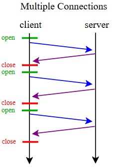</td>
        <td align="center" colspan="2">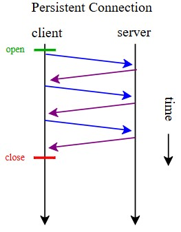</td>
    </tr>
    <tr>
        <td rowspan="3"></td>
        <td align="center"><strong>Persistencia sin pipeline</strong></td>
        <td align="center"><strong>Persistencia con pipeline</strong></td>
    </tr>
    <tr>
        <td>El cliente envía un nuevo requerimiento sólo cuando el previo ha sido recibido</td>
        <td>El cliente envía requerimientos tan pronto éste encuentra un objeto referenciado</td>
    </tr>
    <tr>
        <td align="center">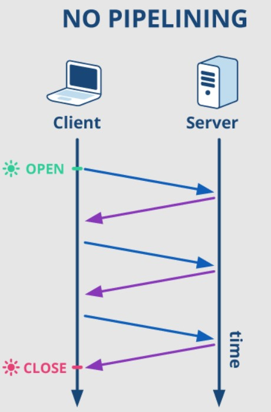</td>
        <td align="center">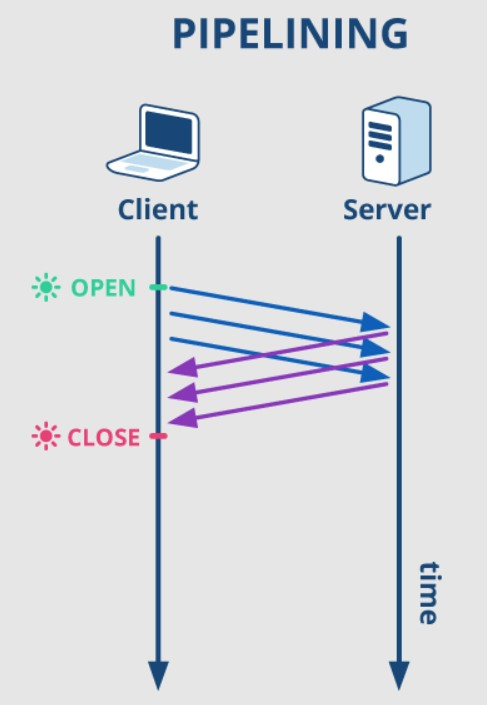</td>
    </tr>
</table>

<table>
    <tr>
        <td align="center">
            <strong>Round-Trip Time (RTT)</strong><br>
            The time it takes to get a response after you initiate a network request.
        </td>
        <td align="center" rowspan="2">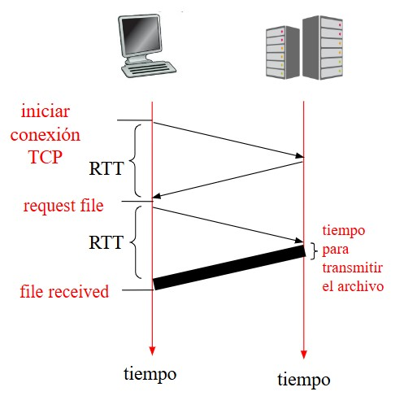</td>
    </tr>
    <tr>
        <td>
            <strong>Tiempo de respuesta</strong>:<br>
            - Un RTT para iniciar la conexión.<br>
            - Un RTT por requerimiento HTTP y primeros bytes de respuesta<br>
            - Tiempo de transmisión del archivo<br>
            <strong>Total</strong>: 2RTT + tiempo de transmisión.
        </td>
    </tr>
</table>

## Mensajes HTTP de respuesta

```
--------------------------------------------------------
|                Línea de Estado (Status Line)          |
--------------------------------------------------------
| HTTP/1.1 200 OK                                       |
--------------------------------------------------------

--------------------------------------------------------
|               Encabezados de Respuesta (Headers)      |
--------------------------------------------------------
| Date: Sat, 03 Aug 2024 12:34:56 GMT                   |
| Content-Type: text/html; charset=UTF-8                |
| Content-Length: 137                                   |
--------------------------------------------------------

--------------------------------------------------------
|                  Cuerpo del Mensaje (Body)            |
--------------------------------------------------------
| <!DOCTYPE html>                                       |
| <html lang="en">                                      |
| <head>                                                |
|     <meta charset="UTF-8">                            |
|     <title>Example</title>                            |
| </head>                                               |
| <body>                                                |
|     <h1>Hello, World!</h1>                            |
| </body>                                               |
| </html>                                               |
--------------------------------------------------------
```

## Códigos HTTP de respuesta

* **1xx**: Respuesta informativa $\rightarrow$ Petición recibida, continuando proceso.

> **101 Switching Protocol** $\rightarrow$ Este código se envía en respuesta a un encabezado de solicitud Upgrade por el cliente. Indica que el servidor acepta el cambio de protocolo propuesto por el usuario.

* **2xx**: Respuestas satisfactorias $\rightarrow$ Indica que la petición fue recibida correctamente, entendida y aceptada.

> **200 OK** $\rightarrow$ Request exitoso, objeto requerido es incluido en el cuerpo del mensaje.

* **3xx**: Redirecciones $\rightarrow$ El cliente tiene que tomar una acción adicional para completar la petición.

> **301 Moved Permanently** $\rightarrow$ Se movió el objeto requerido, nueva ubicación es especificada luego en el mensaje (Location:).

* **4xx**: Errores del cliente $\rightarrow$ La solicitud contiene sintaxis incorrecta o no puede procesarse.

> **404 Not Found** $\rightarrow$ Documento no encontrado en el servidor. 

* **5xx**: Errores del servidor $\rightarrow$ El servidor falló al completar una solicitud aparentemente válida.

> **505 HTTP Version Not Supported** $\rightarrow$ El servidor no soporta la versión del protocolo HTTP utilizada en la petición del navegador.

# Manejo de certificados

1. El **navegador solicita una conexión** segura al servidor del sitio web.
2. El servidor **envía su certificado emitido por una autoridad de certificación (CA)**. Este incluye la clave pública del servidor y la firma de la autoridad.
3. El **navegador verifica la autenticidad del certificado** asegurándose de que está firmado por una CA de confianza, y que el mismo no haya expirado o haya sido revocado.

* **¿Cómo se verifica?**

    1. El navegador verifica si el certificado forma parte de una cadena de confianza que conecta con una CA raíz almacenada en su lista de CAs de confianza.
    2. El navegador utiliza la clave pública de la CA para descifrar la firma digital del certificado del servidor. Si el resultado coincide con el hash del contenido del certificado, confirma que la firma es válida y que el certificado no ha sido alterado.
    3. El navegador comprueba la fecha de expiración del certificado y que el certificado sigue siendo válido.

4. Una vez verificado, **el navegador y el servidor establecen una conexión segura**. Negocian una clave de sesión cifrada que se usa para encriptar todos los datos transferidos durante la sesión.

> [!NOTE]
> Con respecto a la **cadena de confianza**: el certificado del servidor está firmado por una CA intermedia, y esta CA intermedia puede estar firmada por otra CA intermedia, hasta que finalmente se llega a una CA raíz.
> 
> ```
> [ Certificado del Servidor (www.ejemplo.com) ]
>            |
>            v
> [ Certificado de CA Intermedia ]
>            |
>            v
> [ Certificado de CA Raíz ]
>            |
>            v
> [Navegador: CA Raíz está en la lista de confianza]
> ```

# Web cache

Es un sistema que se encarga de almacenar localmente datos ya solicitados y así poder acceder a éstos más rápidamente en el futuro.

* Se clasifica como un tipo de proxy de caché.
* Almacena las respuestas de las solicitudes web.
* Puede ser instalado en diferentes niveles, como a nivel cliente, a nivel de red, o a nivel de servidor.
* Reduce el tráfico en el enlace de acceso al ISP.

**Funcionamiento:**

1. El browser envía todos los requerimientos HTTP al cache. 
2. Si el objeto está en el cache, cache retorna el objeto. 
3. En caso de no tener el objeto, cache solicita el objeto al servidor web, lo almacena y lo retorna al cliente.

> [!CAUTION]
> Un problema que puede tener un web cache mal configurado es la obsolencia que pueden tener los datos locales.

# Domain Name System (DNS)

Un host se puede identificar de dos maneras:
* Nombre de host (dominio)  $\rightarrow$   preferido por personas.
    * A la etiqueta ubicada más a la derecha se le llama **dominio de nivel superior**. Como com en www.google.com, o es en www.wikipedia.es
    * Cada etiqueta a la izquierda especifica un **subdominio**. Este incluye el nombre de la máquina, y más a la izquierda de este, se especifica la manera de crear una ruta lógica a la información requerida.
* Dirección IP  $\rightarrow$   preferido por los routers.

Cuando un usuario ingresa un nombre de dominio, es el DNS el que se encarga de mapear/traducir este nombre a dirección IP:

1. El cliente ejecuta la aplicación DNS.
2. El navegador extrae el nombre de host, www.unaescuela.edu , del URL y pasa el nombre de host al lado del cliente de la aplicación DNS.
3. El cliente DNS envía una consulta que contiene el nombre de host a un servidor DNS.
4. El cliente DNS recibe una respuesta. Esta incluye la dirección IP correspondiente al nombre del host.
5. Una vez que el navegador recibe la dirección IP del servidor DNS, puede iniciar una conexión TCP con el proceso servidor HTTP localizado en el puerto 80 en esa dirección IP.

Algunas de las características de los servidores DNS son:

* Organizados jerárquicamente y distribuidos alrededor del mundo.
* Ningún servidor DNS dispone de todas las correspondencias de todos los host de internet.
* Es una base de datos que almacena registros de recursos (resource record, RR).

Lo anterior se da, ya que si se centralizaran los DNS, sería un único punto de falla, habría una enorme cantidad de tráfico que generaría retardos de acceso y sería difícil de mantener.

## Clases de servidores DNS

* **Servidor DNS recursivo**: recibe una consulta del cliente y verifica si la respuesta ya está almacenada en su caché.

* **Servidor DNS local**: está configurado en una red local (como una oficina o una red doméstica) para proporcionar servicios DNS a los dispositivos dentro de esa red. Similar al DNS recursivo (solo que a nivel local), se encarga de almacenar en caché las consultas para mejorar el rendimiento, y puede implementar políticas de filtrado, bloqueo de sitios, o redirección de tráfico para dispositivos dentro de la red local.

    * No pertenece estrictamente a la jerarquía.
    * Cuando un host hace una consulta DNS, ésta es enviada a su servidor DNS local.

<p align="center">
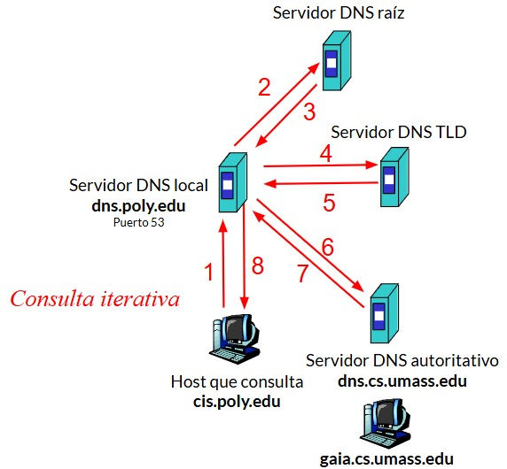
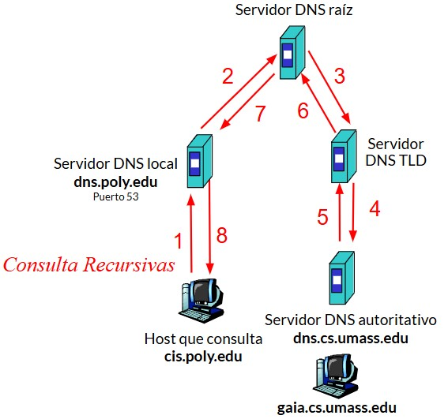
</p>

* **Servidor DNS raíz**: redirigen las consultas a los servidores TLD apropiados.

* **Servidores de Dominio de nivel superior (Top-Level Domain, TLD)**: gestionan los dominios de nivel superior, siendo algunos .com, .org, .net, .edu, etc, así como los códigos de país como .uk, .ar, .jp.

* **Servidores DNS Autoritarios**: contienen la información definitiva sobre un dominio específico. Son responsables de responder a las consultas DNS con respuestas autorizadas.
Tipos de registros:
    * **A (Address)**: Dirección IPv4.
    * **AAAA (IPv6 Address)**: Dirección IPv6.
    * **CNAME (Canonical Name)**: Alias de otro dominio.
    * **MX (Mail Exchange)**: Servidor de correo.
    * **TXT (Text)**: Información de texto.

<p align="center">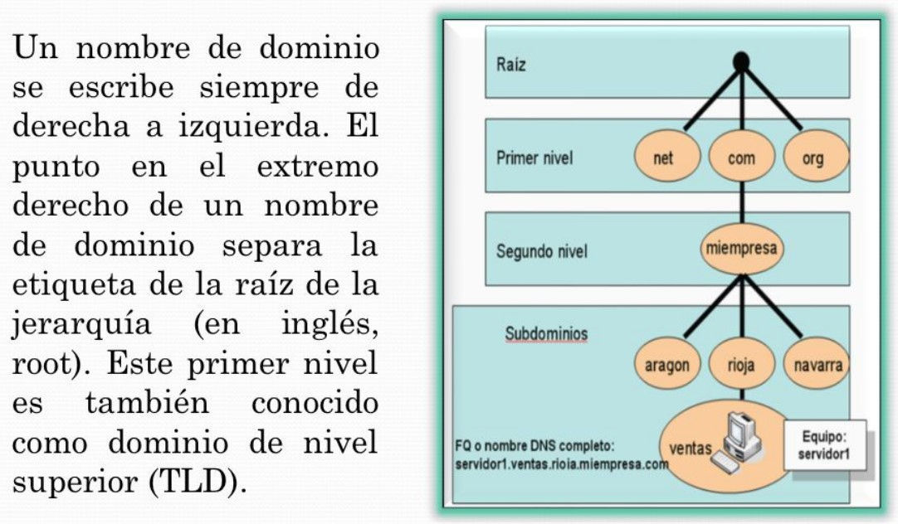</p>

## Registros DNS

<p align="center">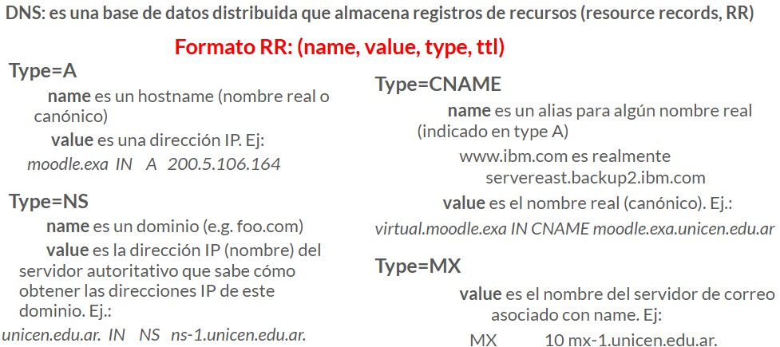</p>
<p align="center">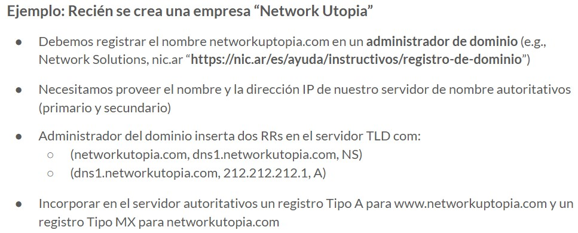</p>

## Otros servicios de DNS

**Alias de host**: útil cuando un host tiene un nombre complicado. Redirige las solicitudes a otro nombre de dominio, que a su vez está asociado con una dirección IP.

# Dynamic Host Configuration Protocol (DHCP)

Es un protocolo de red tipo cliente/servidor donde un servidor DHCP asigna dinámicamente una dirección IP y otros parámetros de configuración de red a cada dispositivo.

DHCP asigna:
* Dirección IP
* Máscara
* Tiempo de vida

Protocolo de nivel de aplicación:
* Corre arriba de UDP.
* Puerto 68 (cliente).
* Puerto 67 (servidor).

**Proceso de comunicación**

1. **Descubrimiento**: el cliente DHCP envía (por broadcast) un mensaje de descubrimiento a la red para localizar un servidor DHCP disponible.
2. **Oferta**: uno o más servidores DHCP responden al cliente con una oferta de configuración, que incluye una dirección IP y otros parámetros de configuración. La respuesta es enviada como un broadcast para asegurar que el cliente la reciba.
3. **Solicitud**: el cliente responde a la oferta aceptando una de las direcciones IP ofrecidas mediante un mensaje de solicitud. Este mensaje también se envía como un broadcast para informar a todos los servidores DHCP sobre la elección del cliente.
4. **Confirmación**: el servidor DHCP seleccionado confirma la asignación enviando un mensaje de confirmación al cliente.

<p align="center">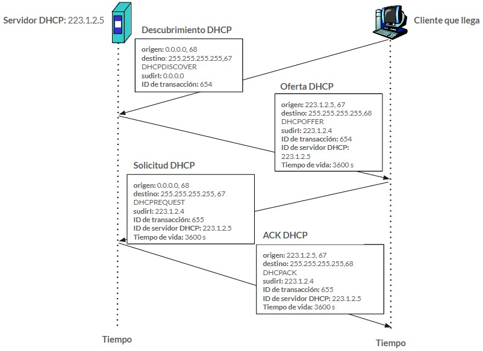</p>

## DHCP: ataques

El intercambio que se produce entre cliente y servidor no incluye autenticación. Esto genera la posibilidad de que en nuestra red existan "rogue servers" o "rogue clients" (servidores o clientes deshonestos).

* **Rogue Server**: se instala un servidor de DHCP en nuestra red, el mismo puede comenzar a responder pedidos legítimos con respuestas que contienen valores que no permiten la conexión a la red.
Otra modo de actuar es otorgando valores lo suficientemente correctos para que la operación sea exitosa, pero cambiando los nombres o puertas de enlace del servidor para redirigir el tráfico.

* **Rogue client**: realiza peticiones continuas al servidor DHCP legítimo, hasta que el mismo agote todas las direcciones asignables que posee. Los clientes legítimos no podrán conectarse. 

**Contramedidas**

1. Inhabilitar en el firewall el paso de los paquetes de DHCP. Así cualquier inconveniente proviene de la red interna.
2. Configurar el servidor para que conecte a una sola placa cuando exista más de una.
3. No utilizar DHCP para asignar direcciones a equipos críticos.
4. Cuando la seguridad sea crítica, realizar asignaciones por dirección MAC.
5. Monitorear los archivos de log/auditorias.

# Extras

## netstat (Network Statistic)

Provee de una lista de puertos abiertos y en uso, conexiones activas, estadísticas, etc.

* En Linux
    * netstat -t  para ver conexiones TCP.
    * netstat -u para ver conexiones UDP.

* netstat -h indica todas las opciones disponibles

* En Windows
    * netstat -p tcp  para ver conexiones TCP.
    * netstat -p udp para ver conexiones UDP.

# Webgrafía

https://es.wikipedia.org/wiki/Socket_de_Internet

https://keepcoding.io/blog/que-es-un-socket/

https://slideplayer.es/slide/1075629/